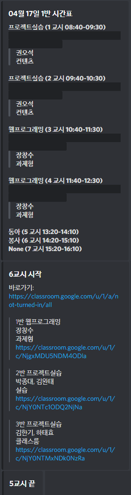

# Busanbu-Chagwan

디스코드에서 밴드 새 글 알림, Spread Sheet 의 온라인 개학 시간표를 명령어로 쉽고 빠르게 볼 수 있게 하기 위해 만들었습니다.

+ 밴드에서 새 글이 올라오면 디스코드로 알려줍니다.
+ "ㄱ시간표" 형식으로 오늘 시간표를 알 수 있습니다.
+ 수업시간이 될 때마다 알림방, 해당하는 수업 클래스룸 주소 알려주고 쉬는시간이 되면 알려줍니다.

# Why I named this Busanbu-Chagwan
저희 디스코드에는 부산부장관이라는 별명을 가진 부산에 거주하는 던전앤파이터/사이퍼즈/시장놀이 등등 여러 게임의 마스터인 친구가 있습니다.

완벽해보이는 그에게도 부족한 점이 있었습니다.
그는 정보의 습득이 느립니다. 그래서 우리는 이를 보완하기 위해 부산부차관이라는 디코봇을 만들게 되었습니다. 

# Special Thanks
+ [부산부장관](https://github.com/1000hg)
+ [Roharui](https://github.com/Roharui)
